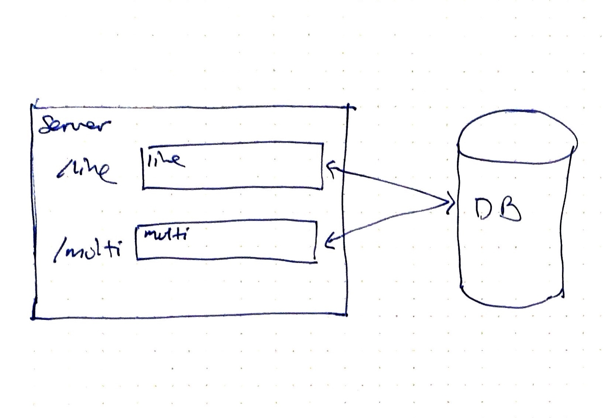

# Train Station Schedules <!-- omit in toc -->

## Table of Contents <!-- omit in toc -->
- [Overview](#overview)
  - [How a new line schedule is saved](#how-a-new-line-schedule-is-saved)
  - [How a query for the next multi line arrival is retrieved](#how-a-query-for-the-next-multi-line-arrival-is-retrieved)
  - [How the database is structured](#how-the-database-is-structured)
  - [Some things I wish I had time to address](#some-things-i-wish-i-had-time-to-address)
- [Quickstart](#quickstart)
  - [Prerequisites](#prerequisites)
  - [Starting the server](#starting-the-server)
  - [Server Endpoints](#server-endpoints)
    - [Add a new train line schedule](#add-a-new-train-line-schedule)
  - [Find the next time more than one train arrives at the same time](#find-the-next-time-more-than-one-train-arrives-at-the-same-time)
  - [Running the tests](#running-the-tests)
- [Requirements](#requirements)
  - [Basics](#basics)
- [Assumptions assumptions](#assumptions-assumptions)
  - [Basic assumptions](#basic-assumptions)
  - [Http Status Code Assumptions](#http-status-code-assumptions)
  - [Database Assumptions](#database-assumptions)

## Overview
This application does two main things:
- Allows clients to POST train line schedules
- Allows clients to query the next time more than one train line arrives at the station at the same minute.

This application uses a Node http server that routes the request to the corresponding handler for the call. Each handler processes the request and makes the necessary calls to a pretend database which is just a JavaScript object.



### How a new line schedule is saved

When a new schedule is saved, these are the steps it goes through:
- Client posts to the server.
- The server routes the information to the designated handler.
- The handler converts the schedule into the right format that we need.
- The handler sends the information to our database helper.
- The database saves the converted schedule into a line key
- The database updates another database key that keeps track of how many train lines arrive at certain minutes during the day.
- The informaiton then gets sent all the way back up to the client.

### How a query for the next multi line arrival is retrieved

When a request for the next time multiple trains arrive at the station at the same time is made, these are the steps the application goes through:
- Client posts to the server.
- The server routes the information to the designated handler.
- The handler checks for the validity of the request.
- The query ``time`` is converted into minutes.
- The handler request the time counts from the database.
- The handler uses helpers to look through the time counts for the next time more than one train will arrive at the station at the same minute.
- Converts the found time into a human readable version before sending the results back up to the client.

### How the database is structured
The database helper has three methods:
- ``set(key, value)``: Helps us set a new database key.
- ``fetch(key)``: Helps us retrieve a database key.
- ``keys()``: Lists all available keys in the database.

The database keys are named in this way:
- Lines are named ``line-<line name>``
- ``time-multi`` Is an array that keeps track of how many trains arrive at certain minutes throughout the day. This array is used as a has where the key is the number of minutes of the day for a time. For example 12:01AM is converted to 1 minute and saved into the array index of 1. If there are two trains that arrive at 12:01AM, the value of index 1 will be 2.

Further information can be found in the function docstrings and inline as well.

### Some things I wish I had time to address
- Unit tests for helpers
- Precommits
- CI/CD pipeline
- Pull request templates
- Structured logging for visibility

## Quickstart
### Prerequisites
- Nodejs

### Starting the server
- Navigate to the root of the project in a terminal.
- Install the application dependencies ``npm i``.
- Start the server with ``npm start``.
- The application should run in ``http://localhost:3000``.
  
### Server Endpoints
#### Add a new train line schedule
- Method: POST
- Path: /line
- body
```json
{
    "line": "2", // The name of the line. Limit to alphanumerical characters and to maximum length of 4.
    "schedule": ["09:10AM", "11:00AM", "01:05PM", "08:17PM"] // Times formatted to hh:mmAM, 12 hour clock with no spaces.
}
```
- Returns 200
```json
{
    "status": "Schedule saved."
}
```

- Errors will return 400 with a message
```json
{
    "status": "Error message."
}
```

### Find the next time more than one train arrives at the same time
- Method: GET
- Path: /nextmulti?time=11:00AM
- Query Parameters:
  - ``time`` formatted in 
- Returns 200
```json
{
    "result": "01:05PM"
}
```

- No result 200
```json
{
    "result": ""
}
```

- Errors return 400 with a message
```json
{
    "status": "Error message."
}
```

### Running the tests
- Run npm ``npm test`` hh:mmAM, 12 hour clock with no spaces.
- Test currently available include:
  - Endpoint tests that make actual calls to the server that is running in a child process.
  - Unit tests against database methods.

## Requirements

### Basics
- [x] Ability to post a new schedule for a train line
   - [x] Sends the train line name
       - [x] up to 4 alphanumeric characters
   - [x] Sends a list of times when the train arrives at the station. Times to the minute
- [x] Ability to get the next time multiple trains will arrive at the station in the same minute
    - [x] Accepts time value as an argument
    - [x] Returns timestamp that reflects the next time 2 or more trains will arrive at the station after the submitted time.

## Assumptions assumptions

### Basic assumptions
- [x] Assume that all trains have the same schedule each day.
Some other behavior assumptions:
- [x] If there are no remaining times after the passed-in time value, should return the first time of the day the next day if there is a time available.
- [x] Should not return no time if there are no instances where there is no match for multiple trains coming in at the same time.

### Http Status Code Assumptions
- [x] Returns 200 for valid requests
- [x] Returns 4xx for invalid requests

### Database Assumptions
- [x] Can call ``db.set(key, value)``
    - [x] **Extra assumption: Wil return no value if there is no error.**
    - [x] **Extra assumption: For now, the db does not care what the value is.**
- [x] Can call ``db.fetch(key)`` 
    - [x] Returns the object at the key if there is a value
    - [x] Returns undefined if there is nothing there
- [x] Can call ``db.keys()``
    - [x] Returns the list of all defined keys in the db
    - [x] returns an empty list if there are no keys
- [x] Database key-value store is thread safe.
- [x] Cannot add new methods to the database.
